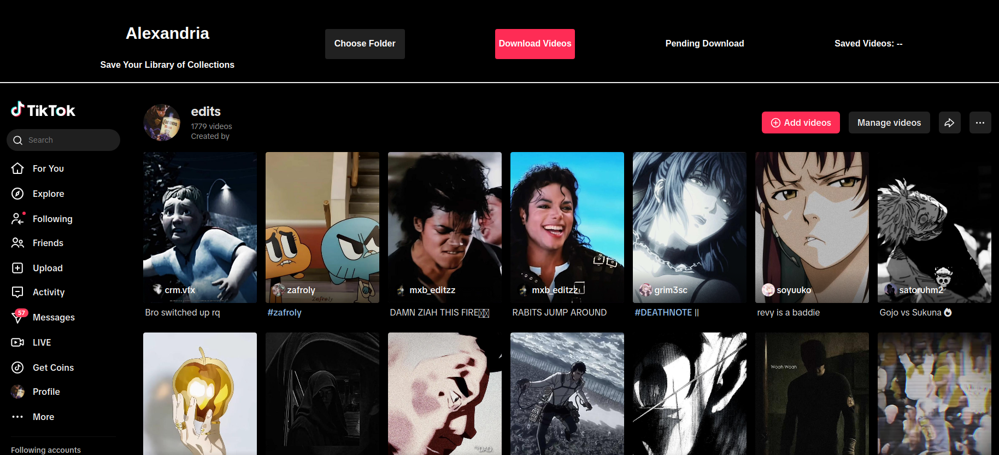

# Alexandria
    

Download your library of collections
## How To Use Extension
Log into your TikTok account that contains the collection you want to download. Navigate to the specific collections page and upon loading or refresh a banner will appear to allow you to choose the folder you want and start downloading videos.

## Key Features
✅ Injects a UI panel into TikTok  
✅ Intercepts network requests to fetch video URLs  
✅ Scrolls automatically to load more videos  
✅ Saves files using the File System Access API  
## Future Improvements 🚀
🔹 Save photo slideshows alongside videos  
🔹 Add metadata to videos  
🔹 Improve script communication from different window contexts
## Installation
Clone the repo then load into Chrome
- Open chrome://extensions/
- Enable Developer mode
- Click "Load unpacked"
- Select the repo folder
## Contributing 
Feel free to open issues or submit PRs to improve the extension

